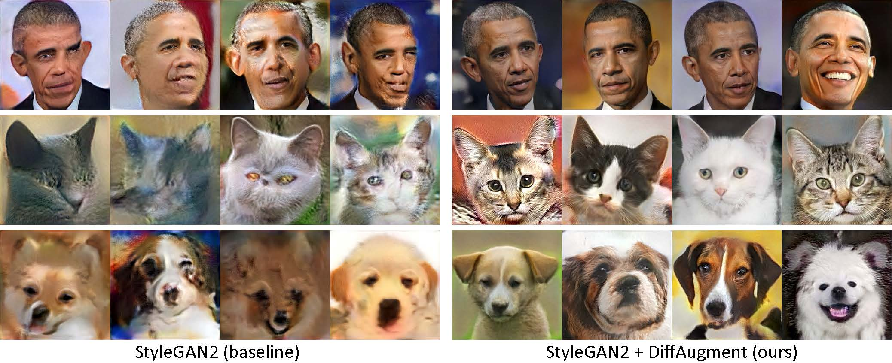
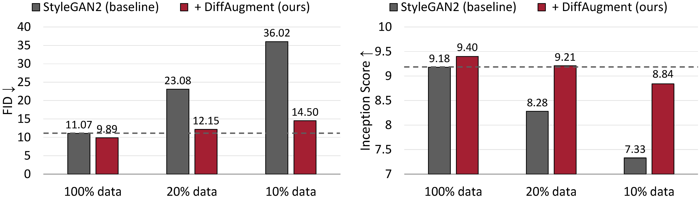
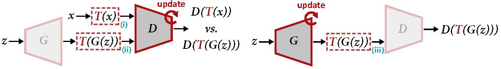

# Data-Efficient GANs with DiffAugment

#### [arXiv preprint](https://arxiv.org/pdf/2006.10738)


*Generated using only 100 images of Obama, grumpy cats, pandas, the Bridge of Sighs, the Medici Fountain, the Temple of Heaven, without pre-training.*

**[NEW!]** Our [Colab tutorial](https://colab.research.google.com/gist/zsyzzsoft/5fbb71b9bf9a3217576bebae5de46fc2/data-efficient-gans.ipynb) is released! [](https://colab.research.google.com/gist/zsyzzsoft/5fbb71b9bf9a3217576bebae5de46fc2/data-efficient-gans.ipynb)

**[NEW!]** FFHQ training is supported! See the [DiffAugment-stylegan2](https://github.com/mit-han-lab/data-efficient-gans/tree/master/DiffAugment-stylegan2#FFHQ) README.

**[NEW!]** Time to generate 100-shot interpolation videos with [generate_gif.py](https://github.com/mit-han-lab/data-efficient-gans/tree/master/DiffAugment-stylegan2/generate_gif.py)!

**[NEW!]** Our [DiffAugment-biggan-imagenet](https://github.com/mit-han-lab/data-efficient-gans/tree/master/DiffAugment-biggan-imagenet) repo (for TPU training) is released!

**[NEW!]** Our [DiffAugment-biggan-cifar](https://github.com/mit-han-lab/data-efficient-gans/tree/master/DiffAugment-biggan-cifar) PyTorch repo is released!

This repository contains our implementation of Differentiable Augmentation (DiffAugment) in both PyTorch and TensorFlow. It can be used to significantly improve the data efficiency for GAN training. We have provided the TensorFlow code of [DiffAugment-stylegan2](https://github.com/mit-han-lab/data-efficient-gans/tree/master/DiffAugment-stylegan2), the PyTorch code of [DiffAugment-biggan-cifar](https://github.com/mit-han-lab/data-efficient-gans/tree/master/DiffAugment-biggan-cifar) for GPU training, and the TensorFlow code of [DiffAugment-biggan-imagenet](https://github.com/mit-han-lab/data-efficient-gans/tree/master/DiffAugment-biggan-imagenet) for TPU training.



*Few-shot generation without pre-training. With DiffAugment, our model can generate high-fidelity images using only 100 Obama portraits, grumpy cats, or pandas from our collected 100-shot datasets, 160 cats or 389 dogs from the AnimalFace dataset at 256×256 resolution.*



*Unconditional generation results on CIFAR-10. StyleGAN2’s performance drastically degrades given less training data. With DiffAugment, we are able to roughly match its FID and outperform its Inception Score (IS) using only **20%** training data.*

Differentiable Augmentation for Data-Efficient GAN Training<br>
[Shengyu Zhao](https://scholar.google.com/citations?user=gLCdw70AAAAJ), [Zhijian Liu](http://zhijianliu.com/), [Ji Lin](http://linji.me/), [Jun-Yan Zhu](https://people.csail.mit.edu/junyanz/), and [Song Han](https://songhan.mit.edu/)<br>
MIT, Tsinghua University, Adobe Research<br>
[arXiv](https://arxiv.org/pdf/2006.10738.pdf)


## Overview


*Overview of DiffAugment for updating D (left) and G (right). DiffAugment applies the augmentation T to both the real sample x and the generated output G(z). When we update G, gradients need to be back-propagated through T (iii), which requires T to be differentiable w.r.t. the input.*

## Training and Generation with 100 Images [](https://colab.research.google.com/gist/zsyzzsoft/5fbb71b9bf9a3217576bebae5de46fc2/data-efficient-gans.ipynb)

To generate an interpolation video using our pre-trained models:

```bash
cd DiffAugment-stylegan2
python generate_gif.py -r mit-han-lab:DiffAugment-stylegan2-100-shot-obama.pkl -o obama.gif
```

or to train a new model:

```bash
python run_few_shot.py --dataset=100-shot-obama --num-gpus=4
```

You may also try out `100-shot-grumpy_cat`, `100-shot-panda`, `100-shot-bridge_of_sighs`, `100-shot-medici_fountain`, `100-shot-temple_of_heaven`, `100-shot-wuzhen`, or the folder containing your own training images. Please refer to the [DiffAugment-stylegan2](https://github.com/mit-han-lab/data-efficient-gans/tree/master/DiffAugment-stylegan2#few-shot-generation) README for the dependencies and details.

## DiffAugment for StyleGAN2

To run *StyleGAN2 + DiffAugment* for unconditional generation on few-shot generation, CIFAR, and FFHQ, please refer to the [DiffAugment-stylegan2](https://github.com/mit-han-lab/data-efficient-gans/tree/master/DiffAugment-stylegan2) README.

## DiffAugment for BigGAN

Please refer to the [DiffAugment-biggan-cifar](https://github.com/mit-han-lab/data-efficient-gans/tree/master/DiffAugment-biggan-cifar) README to run *BigGAN + DiffAugment* for conditional generation on CIFAR (using GPUs), and the [DiffAugment-biggan-imagenet](https://github.com/mit-han-lab/data-efficient-gans/tree/master/DiffAugment-biggan-imagenet) README to run on ImageNet (using TPUs).

## Using DiffAugment for Your Own Training

To help you use DiffAugment in your own codebase, we provide portable DiffAugment operations of both TensorFlow and PyTorch versions in [DiffAugment_tf.py](https://github.com/mit-han-lab/data-efficient-gans/blob/master/DiffAugment_tf.py) and [DiffAugment_pytorch.py](https://github.com/mit-han-lab/data-efficient-gans/blob/master/DiffAugment_pytorch.py). Generally, DiffAugment can be easily adopted in any model by substituting every *D(x)* with *D(T(x))*, where *x* can be real images or fake images, *D* is the discriminator, and *T* is the DiffAugment operation. For example,

```python
from DiffAugment_pytorch import DiffAugment
# from DiffAugment_tf import DiffAugment
policy = 'color,translation,cutout' # If your dataset is as small as ours (e.g.,
# 100 images), we recommend using the strongest Color + Translation + Cutout.
# For large datasets, try using a subset of transformations in ['color', 'translation', 'cutout'].
# Welcome to discover more DiffAugment transformations!

...
# Training loop: update D
reals = sample_real_images() # a batch of real images
z = sample_latent_vectors()
fakes = Generator(z) # a batch of fake images
real_scores = Discriminator(DiffAugment(reals, policy=policy))
fake_scores = Discriminator(DiffAugment(fakes, policy=policy))
# Calculating D's loss based on real_scores and fake_scores...
...

...
# Training loop: update G
z = sample_latent_vectors()
fakes = Generator(z) # a batch of fake images
fake_scores = Discriminator(DiffAugment(fakes, policy=policy))
# Calculating G's loss based on fake_scores...
...
```

## Citation

If you find this code helpful, please cite our paper:
```
@article{zhao2020diffaugment,
  title={Differentiable Augmentation for Data-Efficient GAN Training},
  author={Zhao, Shengyu and Liu, Zhijian and Lin, Ji and Zhu, Jun-Yan and Han, Song},
  journal={arXiv preprint arXiv:2006.10738},
  year={2020}
}
```

## Acknowledgements

We thank NSF Career Award #1943349, MIT-IBM Watson AI Lab, Google, Adobe, and Sony for supporting this research. We thank TensorFlow Research Cloud for supporting this research with Cloud TPUs. We thank William S. Peebles and Yijun Li for helpful comments.

